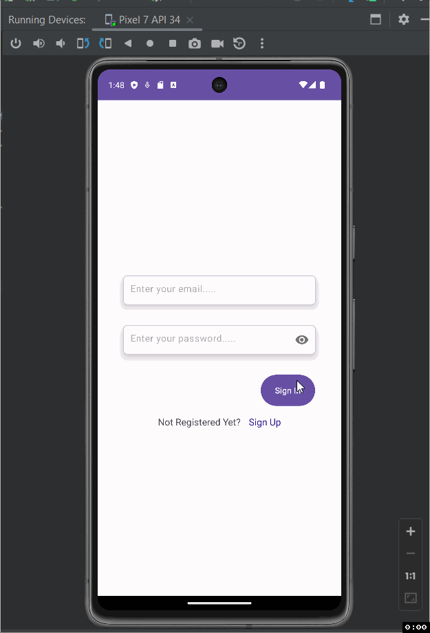

Notes Application

Description of the project ...

- The Project is a remodeled Notes Application that uses Firebase Auth and realtime database to fetch user info and data. It should also have updated and better styling of the UI.

## Functionality 

The following **required** functionality is completed:

NOTE: It's not very clear what and why we need to use UserScreen. What I have are 2 fragments for Signin and Signup which are prompted when the app opens if the user is not currently logged in. In the toolbar, there is a Logout button.

* [ ] Uses Firebase realtime database correctly
* [ ] Correct layout for Main Screen 
* [ ] Correct layout for RecyclerView 
* [ ] Use Firebase Authentication
* [ ] UserScreen is implemented correctly
* [ ] Implements addValueEventListener to update the RecyclerView
* [ ] Menu Items and Listeners
* [ ] Shows Dialog to confirm
* [ ] Initial prompt to login/signup
* [ ] Application does not crash
* [ ] Appropriate comments
* [ ] README.md file

The following **extensions** are implemented:

* Firebase Authentication
* Firebase Realtime Database

## Video Walkthrough

Here's a walkthrough of implemented user stories:

GIF created with [LiceCap](http://www.cockos.com/licecap/).

## Notes

Describe any challenges encountered while building the app.

- Understanding, using, and implementing the database.

## License

    Copyright [yyyy] [name of copyright owner]

    Licensed under the Apache License, Version 2.0 (the "License");
    you may not use this file except in compliance with the License.
    You may obtain a copy of the License at

        http://www.apache.org/licenses/LICENSE-2.0

    Unless required by applicable law or agreed to in writing, software
    distributed under the License is distributed on an "AS IS" BASIS,
    WITHOUT WARRANTIES OR CONDITIONS OF ANY KIND, either express or implied.
    See the License for the specific language governing permissions and
    limitations under the License.
